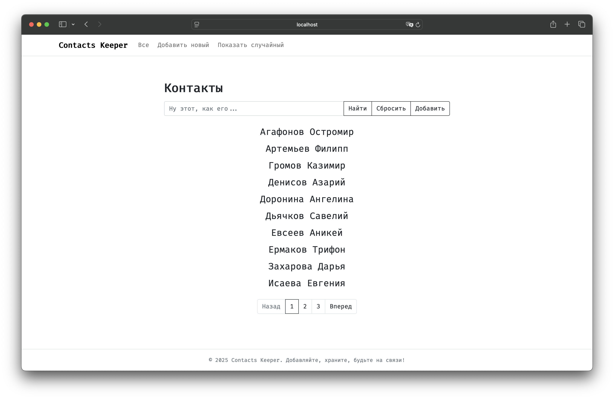
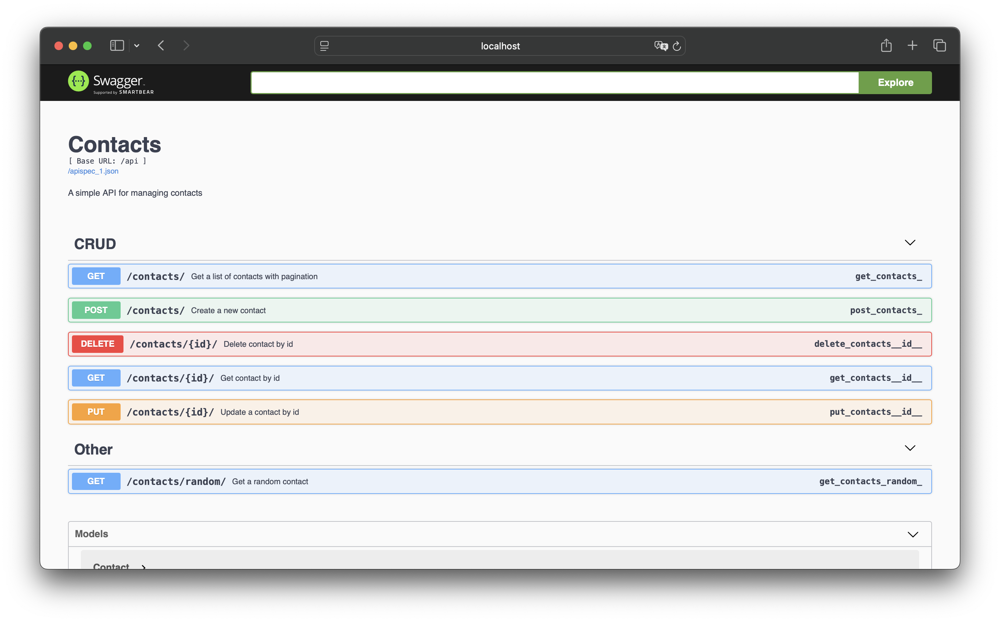
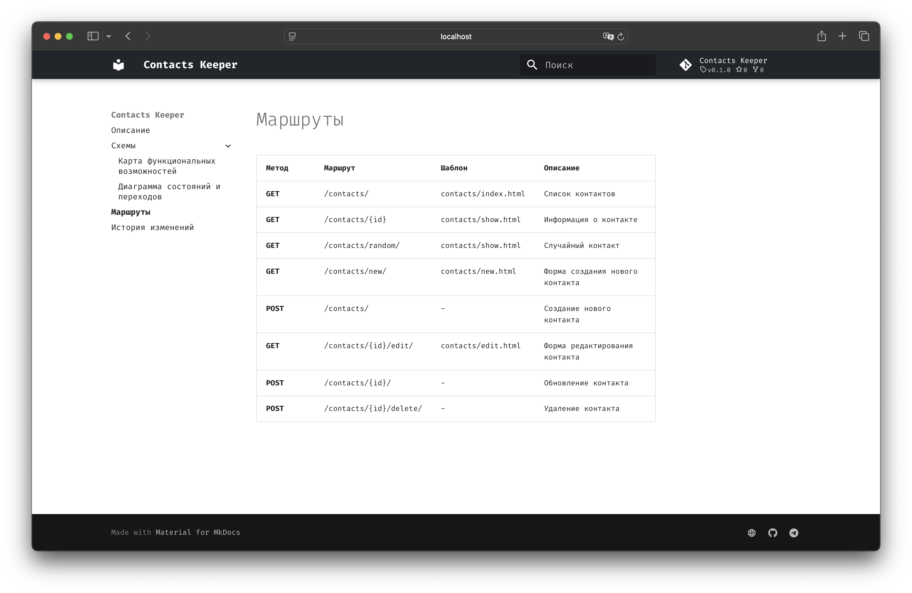

<p align="center">
  <picture>

    </picture>
  </a>
</p>
<h1 align="center">
  Contacts Keeper
</h1>

<p align="center">
A minimalist contact management application
</p>



## Getting Started

1. Clone the repository:

```
git clone https://github.com/atrskv/contacts-keeper.git
```

2. Install dependencies:

```
uv sync
```

3. Prepare the .env files:

```
cp .env.example.dev .env.dev
```

```
cp .env.example.prod .env.prod
```

4. Run the application:

```
make dev-up
```

Or for production:

```
make prod-up
```

When running in dev mode, the app will be available at: http://localhost:8080/

In prod mode: `http://localhost:80/`

The project includes API documentation. Once the app is running, you can access it at: `http://localhost:8080/apidocs/`




5. To launch the documentation *(built with [MkDocs](https://squidfunk.github.io/mkdocs-material/))*:

```
make docs-up
```

Available at: `http://localhost:8081/`




